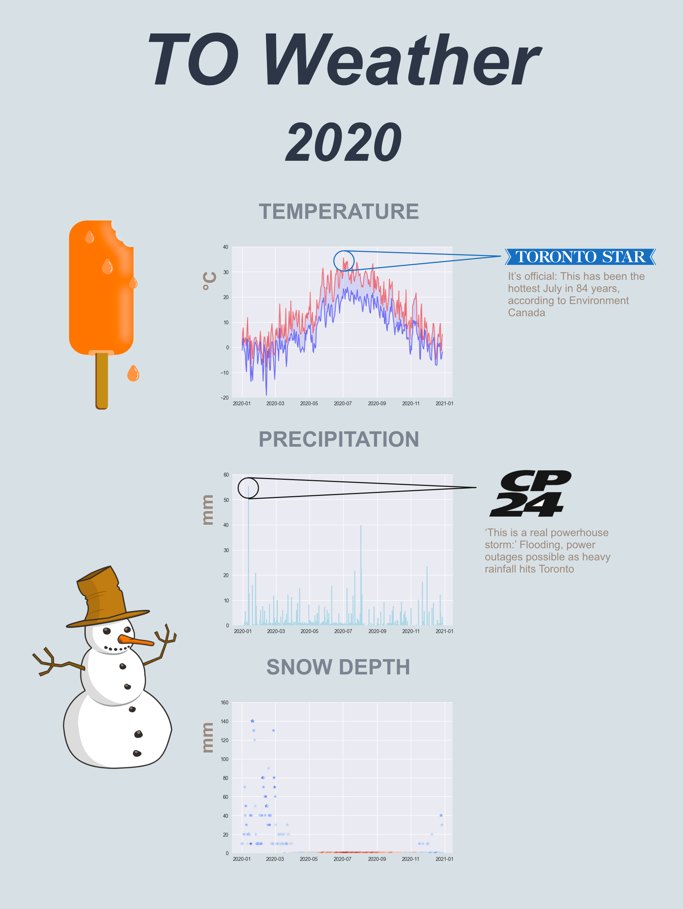

# Toronto Weather
A program that displays the temperature, precipitation, and snow depths of
Toronto in 2020. It provides a digestible weather infographic about a year
in the Great White North.

## Installation
This program was create in Python 3. It requires matplotlib.

## Usage

## Credits
[William Kang](https://github.com/willkang7)

## License
[MIT](LICENSE)
